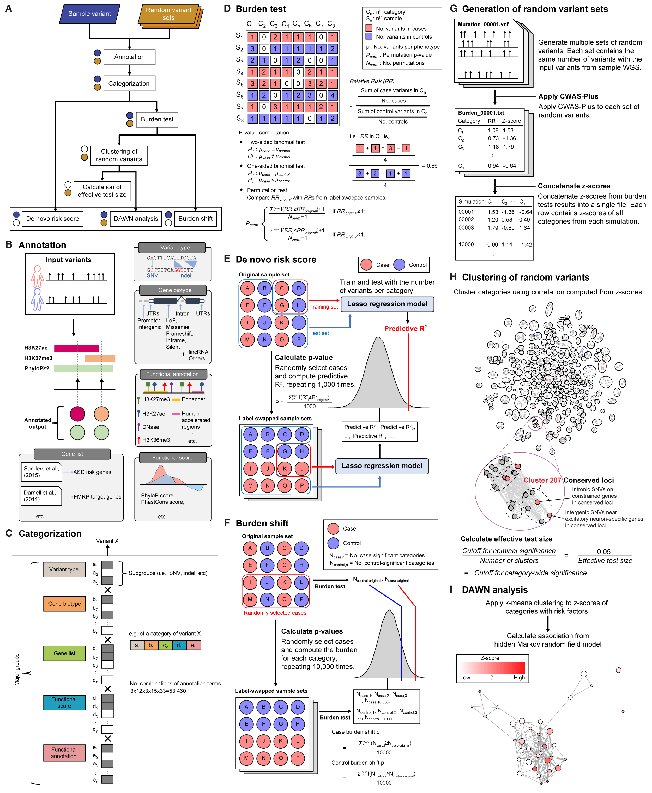

.. CWAS-Plus documentation master file, created by
   sphinx-quickstart on Wed May 10 00:04:11 2023.
   You can adapt this file completely to your liking, but it should at least
   contain the root `toctree` directive.

=====================================
Welcome to CWAS-Plus's documentation!
=====================================

CWAS (Category-Wide Association Study) is a data analytic tool to perform stringent association tests to find non-coding loci associated with autism spectrum disorder (ASD). CWAS runs category-based burden tests using de novo variants from whole genome sequencing data and diverse annotation data sets.

CWAS was used in the following papers.

* `An analytical framework for whole genome sequence association studies and its implications for autism spectrum disorder <https://www.ncbi.nlm.nih.gov/pmc/articles/PMC5961723/>`_ (Werling et al., 2018)
* `Genome-wide de novo risk score implicates promoter variation in autism spectrum disorder <https://www.ncbi.nlm.nih.gov/pmc/articles/PMC6432922/>`_ (An et al., 2018)

Here is the original CWAS repository: `sanderslab/cwas <https://github.com/sanderslab/cwas>`_

--------------------
CWAS-Plus workflow
--------------------

.. toctree::
   :maxdepth: 1
   :caption: CWAS-Plus tutorial

   quickstart/tutorial.rst

.. toctree::
   :maxdepth: 1
   :caption: CWAS-Plus requirements

   required/installation.rst

.. toctree::
   :maxdepth: 1
   :caption: CWAS-Plus datasets

   dataset/overview_dataset.rst
   dataset/genelist.rst
   dataset/functional_annotations.rst
   dataset/functional_scores.rst

.. toctree::
   :maxdepth: 1
   :caption: CWAS-Plus configuration

   config/configuration.rst

.. toctree::
   :maxdepth: 1
   :caption: CWAS-Plus steps

   steps/annotation.rst
   steps/categorization.rst
   steps/burden.rst
   steps/generation_randomset.rst

.. toctree::
   :maxdepth: 1
   :caption: Other useful commands

   utils/extract_variants.rst

.. toctree::
   :maxdepth: 1
   :caption: Connect

   GitHub <https://github.com/joonan-lab/cwas>

